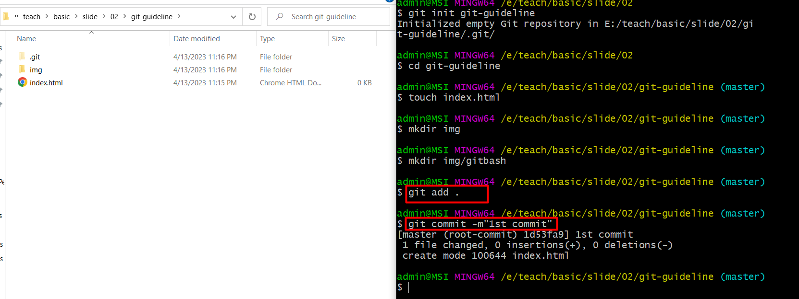

# GIT BASH

1. Vào folder muốn tạo git 

2. Thiết lập local repo 
   Trên log sẽ báo đã tạo được 1 repo git trống, ở trên folder sẽ thấy file .git (nếu không thấy tức là file ẩn)

3. Add các thay đổi vào khu vực staged & commit. Không hiểu khái niệm staged thì mọi người chỉ cần nhớ trước khi git commit thì git add là được. Đây là thao tác commit thay đổi vào local repo 

4. Lên trên github tạo 1 remote repo
   Tạo xong github sẽ cho biết các thông tin kết nối với remote là gì: trong đó có giao thức HTTPS/SSH, mặc định đang chọn HTTPS
   

5. Kết nối local repo & remote repo. Ở đây "origin" được hiểu là tên mặc định của remote repo, hoàn toàn có thể thay đổi được tên nhé.
   Sau đó local repo push lên remote bằng lệnh "git push origin master" - trong đó master là tên nhánh mặc định. Mọi người nhìn trên gitbash ngay từ khi tạo local repo thì đã hiện tên nhánh master kia. 1 số máy có thể hiện là main thì sửa lệnh là "git push origin main"
   

# VSCODE

1. Mở folder git vừa thao tác bằng Vscode
   

2. Mở terminal vscode, hoàn toàn thao tác được trên terminal vscode như gitbash nhé, các lệnh git giống nhau hết
   

3. Thêm các ảnh vào repo, vào phần git trên vscode sẽ thấy hiện các 7 thay đổi ở bên dưới
   

4. Bây giờ chuyển các thay đổi vào khu vực staged (khu vực chuẩn bị cho việc commit) bằng lệnh git add. Ở đây dùng lệnh "git add <file_name>" add từng file vào.
   
   Hoặc có thể add tất cả file bằng lệnh "git add ."
   Như vậy tất cả các thay đổi đều được vào khu vực staged rồi.
   
5. Thực hiện commit & push như với git bash nhé.
   Commit xong mọi người thấy chúng ta đã tạo được 2 commit rồi, có thể lên trên remote để kiểm tra nhé
   
6. Tạo nhánh mới: git branch <branch_name> (ví dụ: git branch phuonganh)
7. Push nhánh từ local lên remote: git push <remote_name><branch_name> (ví dụ git push origin phuonganh)
8. Chuyển nhánh: git checkout <banch_name> (Đang đứng ở nhánh master, muốn chuyển nhánh -> git checkout phuonganh)
9. Thao tác merge 2 nhánh
   Ví dụ: Bạn đang đứng ở nhánh phuonganh, bạn muốn chuyển dữ liệu ở nhánh phuonganh sang nhánh master.
   b1 -> checkout sang nhánh master: git checkout master
   b2 -> merge nhánh phuonganh: git merge phuonganh (nếu không conflict, xuất hiện dòng log thông báo các file thay đổi)
   b3 -> đẩy dữ liệu lên remote: git push origin master
10. Lưu ý các lệnh với git có thể thao tác bằng tay qua Vscode nhé. (Nên cài thêm các extension của git: Gitlens, Git History)
    
